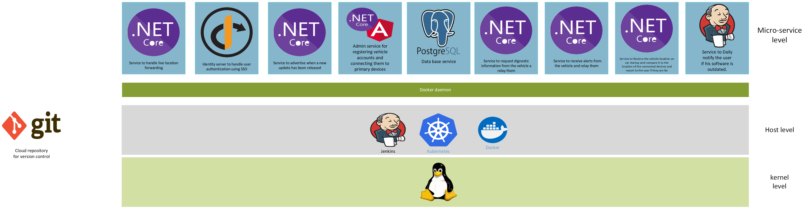
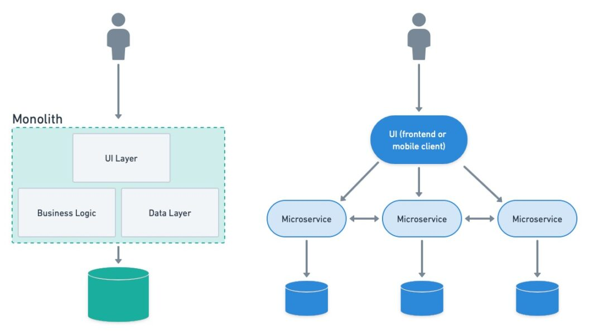
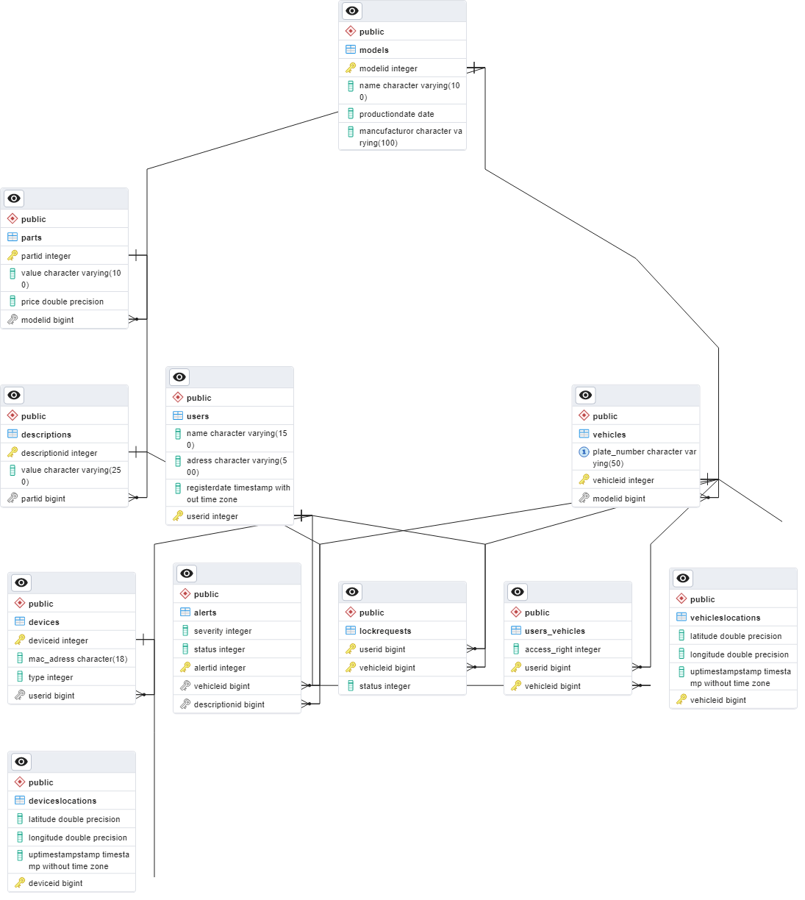

# Telematics control unit - the key to smart cars

## Back end server

### Definition and purpose
The back end server is will provide a cloud platform to allow the TCU to achieve the following functionalities.

- vehicle location tracking using GPS
- Provide daily diagnostic reports on the vehicle and updated maintenance notifications. 
- provide instant notifications if any malfunction occur as soon as it happens.
- Provide instant alert if the vehicle is being accessed when the user phone is away from it.
- provide an automated crisis management protocol to triggered by the mobile companion application or through a web interface.

### Requirements

- Data base server to store the user information.

- web api to handle user information.

- web api for the vehicle to submit it's information and generate a diagnostics report based on it's information.
including the recommended actions like maintenance.

- web api for vehicle to send an alert of any malfunction as soon as it happens.

- provide an api for the vehicle to send it's location as soon as it starts and compare it with the last known location of the device where the companion app is installed and if they are far send a notification to the owner for him to respond to this incident.

- provide an api for the user submit a request to stop his car and get a live location of his vehicle.

- Jenkins server for creating automated pipelines for handling server day to day operations and automating code migration from development to production environment using CI/CD build.

### Development model

#### For this project we will use the <a target="_blank" href="https://aws.amazon.com/devops/what-is-devops/">DevOps model </a>

  

### Software architecture

#### <a target="_blank" href="https://microservices.io/">Micro-service based architecture</a>

  

### Required technologies

- For the database micro-service we will use <a target="_blank" href="https://www.postgresql.org/">PostGreSQL</a>
    

        
    

- We will use ASP-NET core to create the web api based micro-services
    

        
    

- We will use <a target="_blank" href="https://angular.io">angular</a> frontend to create the web-UI

    

- We will use <a target="_blank" href="https://flutter.dev/?gclid=Cj0KCQiA-JacBhC0ARIsAIxybyNtwd-LzzoVvK2jBUaFvAX05aUbwePUQouItgBRIx5Kun0SuLdoFVIaAkW7EALw_wcB&gclsrc=aw.ds">flutter</a> to create the mobile companion app UI

    

- <a target="_blank" href="https://www.jenkins.io/">jenkins</a> for automation and testing pipelines
    

    
    

- <a target="_blank" href="https://www.docker.com/">Docker</a> for creating the micro-service containers combined with <a target="_blank" href="https://kubernetes.io/">Kubernetes</a> for service orchestration
    

         
         
    

- Will run use <a target="_blank" href="https://www.linux.org/">Linux</a> based server and <a target="_blank" href="https://www.nginx.com/">NGINX</a> as a reverse proxy for request routing
    

         
         
    

### Implementation

#### Data base layer

- ERD diagram
    
    

         
    

